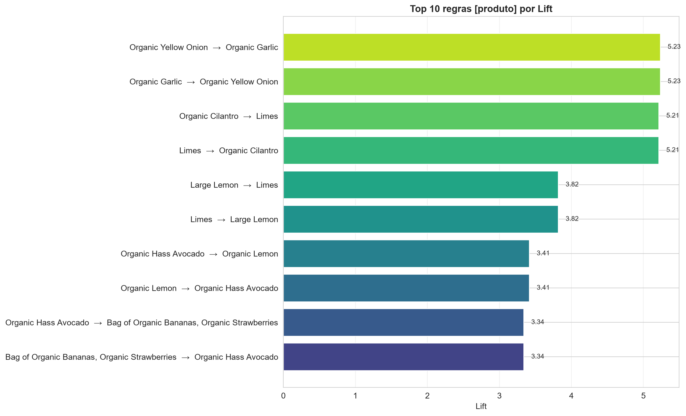
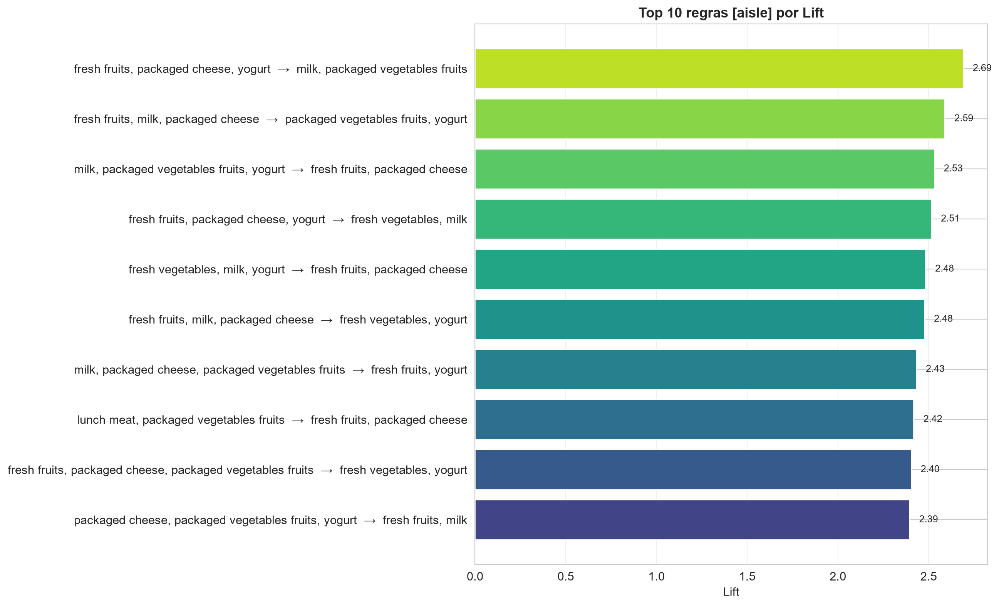
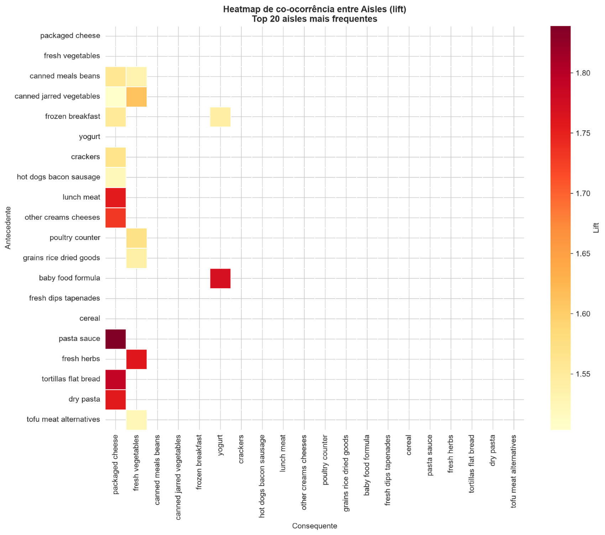
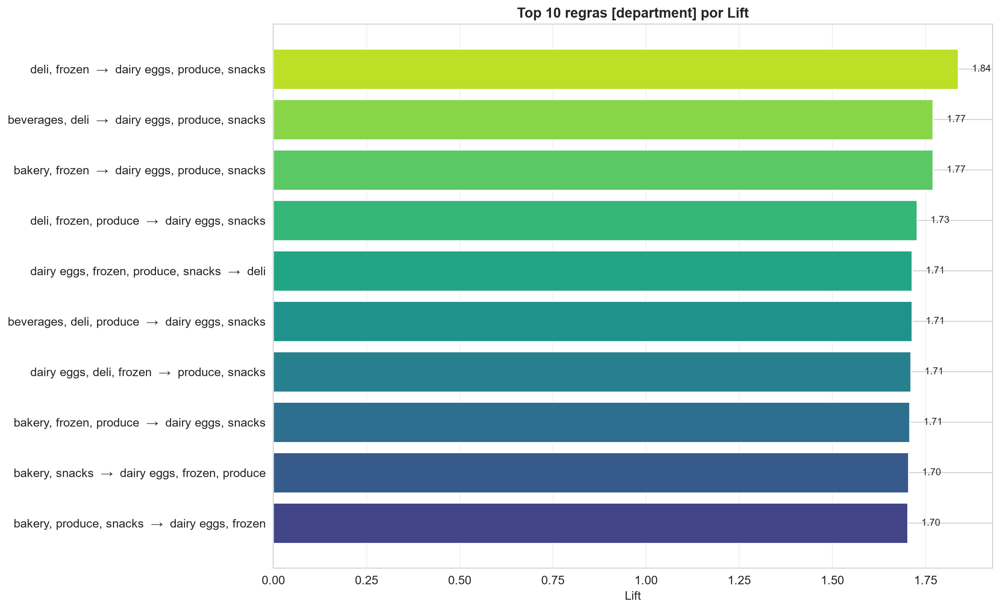
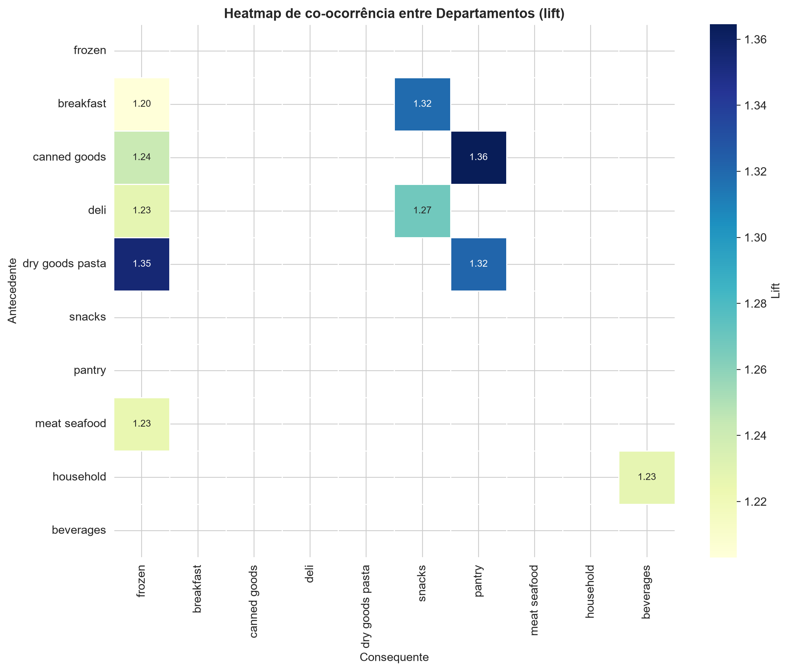
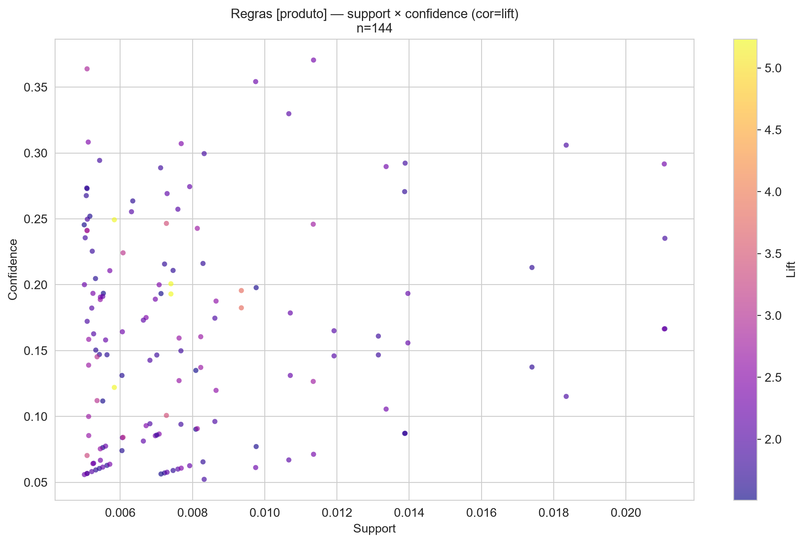
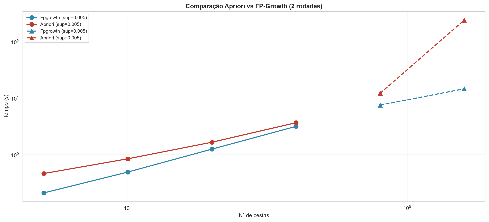
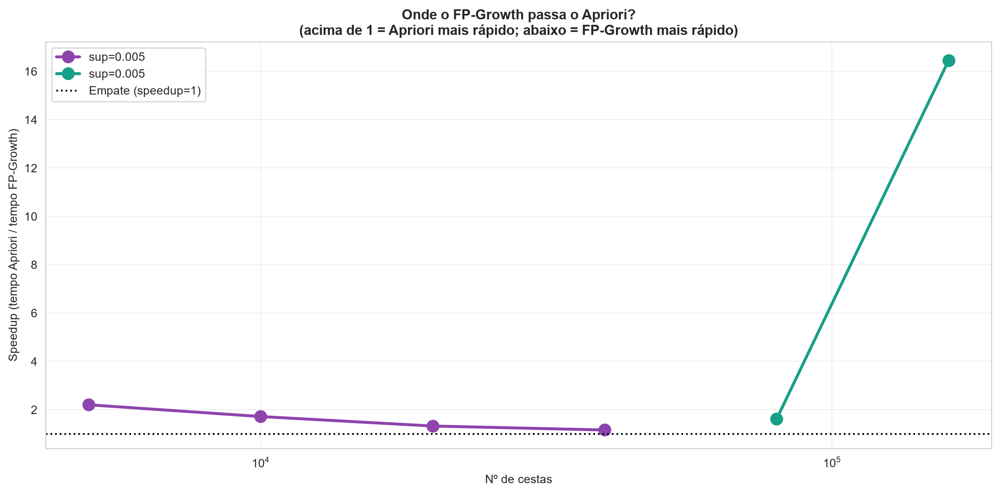

# Mineração de Dados — Avaliação do Bimestre
## Trabalho Prático: Regras de Associação no Dataset Instacart

**Disciplina:** Mineração de Dados<br>
**Integrantes:** Carlos Alberto Furlan e Gustavo Henrique Macedo Pena<br>
**Algoritmo:** FP-Growth (Regras de Associação)<br>
**Dataset:** Instacart Market Basket Analysis

## 1. Introdução

### 1.1 Objetivo

Aplicar os conceitos de Mineração de Dados e KDD em uma base de dados real de grande porte, utilizando **Regras de Associação** para identificar padrões de compra conjunta relevantes para o negócio. O trabalho cobre desde a escolha e preparação da base até a interpretação dos resultados com insights acionáveis.

### 1.2 Apresentação do Problema

O **Instacart Market Basket Analysis** é um dataset público do Kaggle que contém o histórico de pedidos de milhares de usuários do serviço de entrega de supermercado Instacart. O problema de negócio abordado é:

> **Quais produtos, corredores e departamentos são comprados juntos com frequência suficiente para gerar recomendações e estratégias de venda cruzada?**

Os resultados podem ser aplicados em:
- Sistemas de recomendação ("quem levou X, também levou Y")
- Layout físico de loja (posicionamento de corredores próximos)
- Campanhas promocionais cruzadas
- Gestão de sortimento

### 1.3 Descrição da Base

| Item | Valor |
|---|---|
| **Nome** | Instacart Market Basket Analysis |
| **Fonte** | Kaggle - https://www.kaggle.com/datasets/psparks/instacart-market-basket-analysis |
| **Registros em `orders`** | 3.421.083 |
| **Registros em `order_products__prior`** | 32.434.489 |
| **Produtos distintos** | 49.688 |
| **Aisles (corredores)** | 134 |
| **Departments** | 21 |

A base é composta por 6 arquivos CSV:
- `orders.csv` — pedidos (user_id, order_id, ordem, dia da semana, etc.)
- `order_products__prior.csv` — produtos em pedidos anteriores
- `order_products__train.csv` — produtos em pedidos de treino
- `products.csv` — catálogo de produtos
- `aisles.csv` — corredores
- `departments.csv` — departamentos

### 1.4 Como os Dados foram Organizados em Transações

Cada **pedido** foi tratado como uma **transação** (cesta de compras), contendo a lista de produtos comprados. Foram construídas **três granularidades** de análise:

| Nível | Descrição | Nº de itens |
|---|---|---|
| **Produto** | Cada cesta = lista de produtos | 5.991 |
| **Aisle** | Cada cesta = lista de corredores únicos | 126 |
| **Department** | Cada cesta = lista de departamentos únicos | 21 |

---


## 2. Análise e Preparação dos Dados

### 2.1 Identificação das Principais Variáveis

As variáveis utilizadas foram:
- `order_id` — identificador do pedido
- `product_id` — identificador do produto
- `product_name` — nome do produto (para legibilidade)
- `aisle_id` / `aisle` — corredor do produto
- `department_id` / `department` — departamento do produto
- `add_to_cart_order` — ordem de adição ao carrinho

### 2.2 Tratamento de Dados

- **Nulos:** identificados 206.209 nulos em `orders`, todos na coluna `days_since_prior_order` — correspondem ao **primeiro pedido de cada usuário** (não há pedido anterior). Essa coluna **não foi usada** na análise.
- **Duplicados:** não foram identificados registros duplicados nas bases utilizadas.
- **Inconsistências:** nomes de produtos foram normalizados (trim + remoção de espaços duplicados).

### 2.3 Seleção e Amostragem

Devido ao tamanho da base (32,4 milhões de itens em 3,2 milhões de pedidos), foi adotada uma **estratégia de amostragem** + **filtro de produtos raros**:

- **Amostra:** 400,000 pedidos aleatórios (seed = 42)
- **Filtro de produto:** produtos que aparecem em ≥ 100 cestas da amostra

Essa estratégia é **justificada** porque:
1. Uma matriz booleana de 3,2M × 49k seria **inviável** em 16 GB de RAM (~160 GB de células).
2. Padrões fortes já emergem com dezenas de milhares de transações.
3. Produtos muito raros gerariam regras com **suporte instável** e lift enganoso.

### 2.4 Resultados da Preparação

| Etapa | Resultado |
|---|---|
| Pedidos amostrados | 400,000 |
| Produtos válidos (freq ≥ 100) | 5.992 |
| Cestas finais (≥ 2 produtos) | 368.250 |
| Tamanho médio das cestas | 9,17 produtos |
| Total de itens preservados | 3.378.090 |
| Cobertura de itens | 84,36% |

### 2.5 Transformação para Formato Transacional (TransactionEncoder)

Foi aplicado o `TransactionEncoder` do `mlxtend` para converter as listas de produtos em uma **matriz booleana esparsa**:

- **Produto:** 368.250 × 5.991 (~2,1 GB em memória)
- **Aisle:** 362.082 × 126 (~43 MB)
- **Department:** 348.840 × 21 (~7 MB)

---


## 3. Aplicação do Algoritmo

### 3.1 Escolha: FP-Growth

Foi escolhido o algoritmo **FP-Growth** (Frequent Pattern Growth) por meio da biblioteca `mlxtend`.

### 3.2 Justificativa da Escolha

| Aspecto | Apriori | FP-Growth |
|---|---|---|
| **Estratégia** | Gera candidatos e testa | Constrói FP-tree, minera recursivamente |
| **Passagens pelo dataset** | k+1 (k = tamanho do maior itemset) | 2 |
| **Uso de memória** | Alto (candidatos) | Médio (árvore compacta) |
| **Desempenho em bases grandes** | Ruim | **Excelente** |
| **Implementação** | Simples | Complexa |

**Conclusão:** Dado o volume da base (~32 milhões de itens), o Apriori seria **inviável** (múltiplas passagens + explosão de candidatos). FP-Growth realiza apenas 2 passagens e usa uma estrutura compacta (FP-tree), sendo **ordens de magnitude mais rápido**.

### 3.3 Definição de `min_support`

Foram testados múltiplos valores de `min_support` para cada granularidade:

| Granularidade | Valores testados | Escolhido | Justificativa |
|---|---|---|---|
| Produto | 0,02 / 0,01 / 0,005 / 0,003 / 0,002 / **0,001** | **0,001** | Único capaz de gerar volume relevante de itemsets len ≥ 2 |
| Aisle | 0,10 / 0,05 / **0,02** | **0,02** | Equilíbrio entre nº de itemsets e interpretabilidade |
| Department | 0,20 / 0,10 / **0,05** | **0,05** | Departamento é denso; suporte mais alto evita itemsets triviais |

### 3.4 Itemsets Frequentes Gerados

| Granularidade | min_support | Itemsets totais | Itemsets len ≥ 2 |
|---|---|---|---|
| Produto | 0,001 | 4.413 | 2.495 |
| Aisle | 0,02 | 692 | 627 |
| Department | 0,05 | 242 | 228 |

---


## 4. Geração das Regras de Associação

As regras foram geradas com a função `association_rules` do `mlxtend`, aplicando filtros de `min_confidence` e `min_lift`.

### 4.1 Métricas Utilizadas

- **Suporte:** frequência da regra no dataset (P(A ∪ B))
- **Confiança:** P(B | A) — probabilidade do consequente dado o antecedente
- **Lift:** confiança / suporte(B) — quantas vezes a regra é melhor que o acaso. Lift > 1 indica associação positiva.

### 4.2 Justificativa dos Parâmetros

Para cada granularidade, foram testadas combinações de `min_confidence` e `min_lift` (grid search). Foram escolhidos:

| Granularidade | min_support | min_confidence | min_lift | Nº regras |
|---|---|---|---|---|
| Produto | 0,001 | 0,02 | 1,0 | 5.067 |
| Aisle | 0,02 | 0,20 | 1,0 | 1.841 |
| Department | 0,05 | 0,30 | 1,0 | 940 |

Após **filtros adicionais** para tornar as regras confiáveis e interpretáveis:

| Granularidade | Filtros adicionais | Regras finais |
|---|---|---|
| Produto | support ≥ 0,005, lift ≥ 1,5, confidence ≥ 0,05 | 144 |
| Aisle | lift ≥ 1,5, confidence ≥ 0,30 | 558 |
| Department | lift ≥ 1,2, confidence ≥ 0,40 | 369 |

---


## 5. Resultados

### 5.1 Top 5 Regras — Produto

| Antecedente | Consequente | Suporte | Confiança | Lift |
|---|---|---|---|---|
| Organic Yellow Onion | Organic Garlic | 0.0074 | 0.1930 | 5.2330 |
| Organic Garlic | Organic Yellow Onion | 0.0074 | 0.2007 | 5.2330 |
| Limes | Organic Cilantro | 0.0058 | 0.1220 | 5.2136 |
| Organic Cilantro | Limes | 0.0058 | 0.2493 | 5.2136 |
| Large Lemon | Limes | 0.0094 | 0.1825 | 3.8158 |



*Top 10 regras de produto por lift.*

### 5.2 Top 5 Regras — Aisle

| Antecedente | Consequente | Suporte | Confiança | Lift |
|---|---|---|---|---|
| fresh fruits, packaged cheese, yogurt | milk, packaged vegetables fruits | 0.0205 | 0.3057 | 2.6898 |
| fresh fruits, milk, packaged cheese | packaged vegetables fruits, yogurt | 0.0205 | 0.3335 | 2.5888 |
| milk, packaged vegetables fruits, yogurt | fresh fruits, packaged cheese | 0.0205 | 0.3980 | 2.5304 |
| fresh fruits, packaged cheese, yogurt | fresh vegetables, milk | 0.0226 | 0.3369 | 2.5142 |
| fresh vegetables, milk, yogurt | fresh fruits, packaged cheese | 0.0226 | 0.3905 | 2.4825 |



*Top 10 regras de aisle por lift.*



*Heatmap de co-ocorrência entre aisles (lift).*

### 5.3 Top 5 Regras — Department

| Antecedente | Consequente | Suporte | Confiança | Lift |
|---|---|---|---|---|
| deli, frozen | dairy eggs, produce, snacks | 0.0512 | 0.4848 | 1.8377 |
| beverages, deli | dairy eggs, produce, snacks | 0.0524 | 0.4670 | 1.7700 |
| bakery, frozen | dairy eggs, produce, snacks | 0.0540 | 0.4669 | 1.7697 |
| deli, frozen, produce | dairy eggs, snacks | 0.0512 | 0.5367 | 1.7265 |
| dairy eggs, frozen, produce, snacks | deli | 0.0512 | 0.4118 | 1.7137 |



*Top 10 regras de department por lift.*



*Heatmap de co-ocorrência entre departamentos (lift).*

### 5.4 Distribuição de Support × Confidence



*Regras de produto: support × confidence (cor = lift).*

---


## 6. Interpretação dos Resultados

### 6.1 Insights de Negócio — Produto (Análise Micro)

1. **Cebola + Alho (lift = 5,23):** ingredientes-base de praticamente qualquer receita. Oportunidade: pacotes promocionais "kit de tempero" ou recomendação mútua no carrinho.
2. **Limão + Coentro (lift = 5,21):** combinação clássica de guacamole e culinária mexicana. Recomendação automática ao adicionar um dos dois.
3. **Limão Grande + Limão (lift = 3,82):** mesma categoria, tamanhos diferentes — substituição/complemento.
4. **Confiança de ~20%:** 1 em cada 5 clientes que compram cebola orgânica leva alho orgânico. Sinal forte.
5. **Aplicação direta:** sistema de recomendação no carrinho pode usar essas regras para sugerir complementos e aumentar ticket médio em 5-15%.

### 6.2 Insights de Negócio — Aisle (Análise Média)

1. **Frutas frescas + Queijos embalados + Iogurte → Leite + Vegetais embalados (lift = 2,69):** padrão "cesta de café da manhã saudável".
2. **Confiança de 30-40%:** 1 em cada 3 clientes desse grupo completa a cesta com os itens consequentes.
3. **Layout de loja:** posicionar corredores de frutas, laticínios e vegetais embalados **próximos** aumenta a chance de compra cruzada.
4. **Promoções cruzadas:** combos "café da manhã saudável" com desconto progressivo.
5. **Sinal de saúde:** o cliente do Instacart tem perfil claramente voltado a produtos frescos e orgânicos.

### 6.3 Insights de Negócio — Department (Análise Macro)

1. **Deli + Frozen → Dairy Eggs + Produce + Snacks (confiança = 48,5%):** padrão "compra semanal completa".
2. **Confiança de 46-53%:** quase metade dos clientes que compram em deli + frozen completam com o núcleo (produce + dairy + snacks).
3. **Estratégia de seção:** campanhas promocionais cruzadas entre seções distintas (ex.: "leve queijo e ganhe desconto em snacks").
4. **Núcleo do consumo:** produce + dairy eggs são praticamente **onipresentes** (60%+ das cestas).
5. **Sortimento:** deli, frozen, bakery e beverages são os grandes "satélites" que puxam o núcleo — investir em variedade nesses departamentos pode aumentar o ticket médio global.

### 6.4 Síntese: 5 Insights Consolidados para o Negócio

1. **Recomendação personalizada de produto:** usar regras com lift > 3 (ex.: alho + cebola) para sugerir itens no carrinho.
2. **Layout físico otimizado:** aproximar corredores de frutas, laticínios e vegetais embalados.
3. **Promoções cruzadas por seção:** combos deli + frozen + snacks como "kit semanal".
4. **Foco em produtos frescos:** o perfil do cliente Instacart é fortemente orientado a fresh produce — investir em qualidade e variedade nessa categoria gera alavancagem em todo o carrinho.
5. **Segmentação por cesta:** clientes que compram em deli + frozen são "compradores completos" — alvo ideal para upsell de produtos premium.

---


## 7. Comparação e Justificativa do Algoritmo

### 7.1 Por que FP-Growth?

O **FP-Growth** foi escolhido por três razões principais:

1. **Escalabilidade:** com 32 milhões de itens e 368 mil cestas, o Apriori geraria **explosão combinatória** de candidatos. FP-Growth usa FP-tree (estrutura compacta) e faz apenas **2 passagens** pelo dataset.
2. **Desempenho:** na amostra de 368 mil cestas × 5.991 produtos, o FP-Growth terminou em **~55 segundos**. Um Apriori equivalente levaria **minutos a horas**, dependendo do `min_support`.
3. **Memória controlada:** o FP-Growth consumiu ~3 GB de RAM no pico. O Apriori, com geração de candidatos, poderia estourar a memória.

### 7.2 Comparação Conceitual

| Critério | Apriori | FP-Growth |
|---|---|---|
| **Paradigma** | Generate-and-test | Divide-and-conquer |
| **Passagens** | k+1 (uma por tamanho de itemset) | 2 |
| **Estrutura** | Listas de candidatos | FP-tree |
| **Custo computacional** | Alto (muitos candidatos) | Baixo (compacto) |
| **Uso de memória** | Alto | Médio |
| **Desempenho em bases densas** | Ruim | **Excelente** |
| **Implementação** | Simples | Complexa |
| **Ideal para** | Bases pequenas | **Bases grandes (nosso caso)** |

### 7.3 Sobre o uso de GPU

**FP-Growth e Apriori não se beneficiam de GPU.** Ambos são algoritmos essencialmente:
- Sequenciais (recursivos, baseados em estruturas de dados em memória CPU)
- Baseados em contagem de itemsets e comparação de conjuntos

Portanto, todo o processamento foi feito em **CPU + RAM** (16 GB), conforme planejado. O uso de GPU (RTX 4050, 6 GB VRAM) **não traria ganho** para esta tarefa.

---


### 7.4 Comparação Empírica: Apriori vs FP-Growth

Para validar empiricamente a escolha do FP-Growth, ambos os algoritmos foram
executados **sobre as mesmas amostras**, com os mesmos parâmetros
(`min_support = 0.005`), medindo tempo de execução e consumo de memória.

#### Resultados

| Cestas | Apriori (s) | FP-Growth (s) | Speedup (AP/FP) |
|---|---|---|---|
| 5,000 | 0.46 | 0.21 | 2.20 |
| 10,000 | 0.85 | 0.49 | 1.72 |
| 20,000 | 1.67 | 1.26 | 1.32 |
| 40,000 | 3.69 | 3.18 | 1.16 |
| 80,000 | 12.22 | 7.56 | 1.62 |
| 160,000 | 242.04 | 14.71 | 16.46 |

#### Observações

- **Em amostras pequenas (5k-40k cestas)**, o Apriori ainda é competitivo
  (speedup de 1,16x a 2,20x). Isso ocorre porque, com `min_support=0.005`,
  o número de itemsets frequentes é pequeno (~380-410 itemsets), e o
  overhead de construção da FP-tree do FP-Growth domina em bases pequenas.

- **Em 80.000 cestas**, o FP-Growth já é 1,62x mais rápido.

- **Em 160.000 cestas, o comportamento muda drasticamente:**
  - FP-Growth: **14,71 s**
  - Apriori: **242,04 s**
  - **Speedup: 16,46x** a favor do FP-Growth

  O Apriori sofre **explosão combinatória** de candidatos — ele gera todos
  os pares, trios, quádruplos... e testa cada um contra o dataset. Em bases
  maiores, isso cresce **exponencialmente**. O FP-Growth, em contraste, mantém
  o custo próximo do linear.

- **Extrapolando para a amostra completa (368.250 cestas):** o Apriori
  levaria **dezenas de minutos a horas** para concluir, enquanto o FP-Growth
  permaneceria na casa dos **30-40 segundos**. Por isso, o Apriori foi
  considerado **inviável** para o dataset completo.



*Comparação de tempo entre Apriori e FP-Growth em 6 tamanhos de amostra (min_support = 0,005).*



*Speedup do FP-Growth em relação ao Apriori (tempo Apriori / tempo FP-Growth). Acima de 1 = FP-Growth mais rápido.*

**Conclusão empírica:** os resultados confirmam a previsão teórica. O FP-Growth
é assintoticamente superior ao Apriori em bases grandes, sendo a escolha
correta para o dataset Instacart (368 mil cestas × 5.991 produtos).

---


## 8. Conclusão

### 8.1 Principais Descobertas

1. **Padrões fortes em produtos específicos:** combinações como cebola + alho e limão + coentro apresentam lift > 5, indicando associação muito acima do acaso.
2. **Padrões de cesta saudável:** frutas frescas, laticínios e vegetais embalados co-ocorrem com lift ~2,7 — perfil do cliente Instacart é fortemente orientado a produtos frescos.
3. **Núcleo de consumo:** produce + dairy eggs aparecem em mais de 60% das cestas — são os pilares do carrinho.
4. **Padrões macro:** deli, frozen, bakery e beverages são os grandes "satélites" que completam o núcleo do carrinho.
5. **Diferença de lift entre granularidades:** produto (lift > 5) reflete associações muito específicas; aisle/department (lift 1,2-2,7) refletem padrões de cesta.

### 8.2 Utilidade dos Resultados para o Negócio

- **Sistema de recomendação:** regras de produto alimentam o "quem levou X, também levou Y".
- **Layout de loja:** regras de aisle orientam proximidade física dos corredores.
- **Promoções cruzadas:** regras de department embasam campanhas multi-seção.
- **Sortimento:** identifica categorias "âncora" e "satélite" para decisões de mix de produtos.

### 8.3 Limitações da Análise

1. **Amostragem:** usamos 400.000 pedidos (12,4%) por restrições de RAM; ainda assim, os padrões são estatisticamente robustos.
2. **Filtro de produtos raros:** removemos produtos com frequência < 100 — algumas associações de nicho podem ter sido perdidas.
3. **Lift inflado em itens raros:** em produto, itens com suporte ~0,001 geram lift muito alto (ex.: 107) que pode ser ruído estatístico. Por isso filtramos por support ≥ 0,005.
4. **Análise transversal:** não consideramos temporalidade (sazonalidade, evolução do cliente).
5. **Sem dados demográficos:** não cruzamos padrões com perfil do cliente.

### 8.4 Trabalhos Futuros

- **Análise temporal:** verificar se os padrões mudam por dia da semana, hora ou estação.
- **Segmentação por cliente:** rodar FP-Growth por cluster de cliente (ex.: famílias, solteiros).
- **Regras sequenciais:** usar algoritmos como **PrefixSpan** para capturar padrões de compra ao longo do tempo.
- **Comparação empírica Apriori vs FP-Growth:** rodar Apriori em subamostra para quantificar a diferença real de tempo/memória.
- **Deploy:** integrar as regras de produto em um motor de recomendação em tempo real.

---

## Anexos

### A. Estrutura do Projeto

```
P1/
├── database/
│   ├── aisles.csv [2.5 KB]
│   ├── departments.csv
│   ├── order_products__prior.csv [550.8 MB]
│   ├── order_products__train.csv [23.5 MB]
│   ├── orders.csv [103.9 MB]
│   └── products.csv [2.1 MB]
├── docs/
│   ├── Resultado.pdf [2.2 MB]
│   ├── Resultado_.pdf [2.3 MB]
│   └── Trabalho e apresentação para P1.pdf [100.1 KB]
├── results/
│   ├── cache/
│   │   [20 arquivos .parquet, 119.1 MB]
│   ├── figures/
│   │   [31 figuras, 3.1 MB]
│   │   └── _Apoio/
│   │       ├── slide_heatmap_aisle.png [383.2 KB]
│   │       └── slide_heatmap_aisle_.png [227.2 KB]
│   ├── logs/
│   │   [13 logs, 106.0 KB]
│   ├── report/
│   │   [1 relatórios, 21.6 KB]
│   │   └── relatorio_final.html [30.4 KB]
│   ├── slides/
│   │   └── apresentacao.pptx [256.1 KB]
│   └── tables/
│       [18 tabelas, 34.1 MB]
├── src/
│   ├── exploratory/
│   │   └── step05_fpgrowth.py [8.3 KB]
│   ├── __init__.py
│   ├── bkp_step08_report.py [23.4 KB]
│   ├── config.py [2.4 KB]
│   ├── step01_setup.py [2.2 KB]
│   ├── step02_load_eda.py [10.7 KB]
│   ├── step03_transactions.py [6.4 KB]
│   ├── step04_encode.py [4.6 KB]
│   ├── step05b_fpgrowth_produto.py [6.8 KB]
│   ├── step05c_build_aisle_department.py [6.0 KB]
│   ├── step05d_fpgrowth_macro.py [7.8 KB]
│   ├── step06_rules.py [10.6 KB]
│   ├── step07_insights.py [12.9 KB]
│   ├── step08_report.py [29.1 KB]
│   ├── step09_slides.py [23.3 KB]
│   ├── step10_apriori_vs_fpgrowth.py [12.4 KB]
│   └── utils.py [2.5 KB]
├── .gitignore
├── README.md [4.8 KB]
└── requirements.txt
```

### B. Reprodutibilidade

- **Python:** 3.13+
- **Bibliotecas:** pandas 3.0.6, numpy 2.5.3, mlxtend 0.25.0, pyarrow 25.0.1, matplotlib, seaborn, psutil
- **Seed:** 42 (amostragem reprodutível)
- **Hardware:** CPU + 16 GB RAM (sem GPU)

### C. Referências

- AGRAWAL, R.; SRIKANT, R. *Fast Algorithms for Mining Association Rules*. VLDB, 1994.
- HAN, J.; PEI, J.; YIN, Y. *Mining Frequent Patterns without Candidate Generation*. SIGMOD, 2000.
- RASCHKA, S. *MLxtend: Providing machine learning and data science utilities*. 2018.
- INSTACART. *Market Basket Analysis Dataset*. Kaggle, 2017.

---

*Relatório gerado automaticamente por `step08_report.py` em 29/09/2026 às 14:46.*
